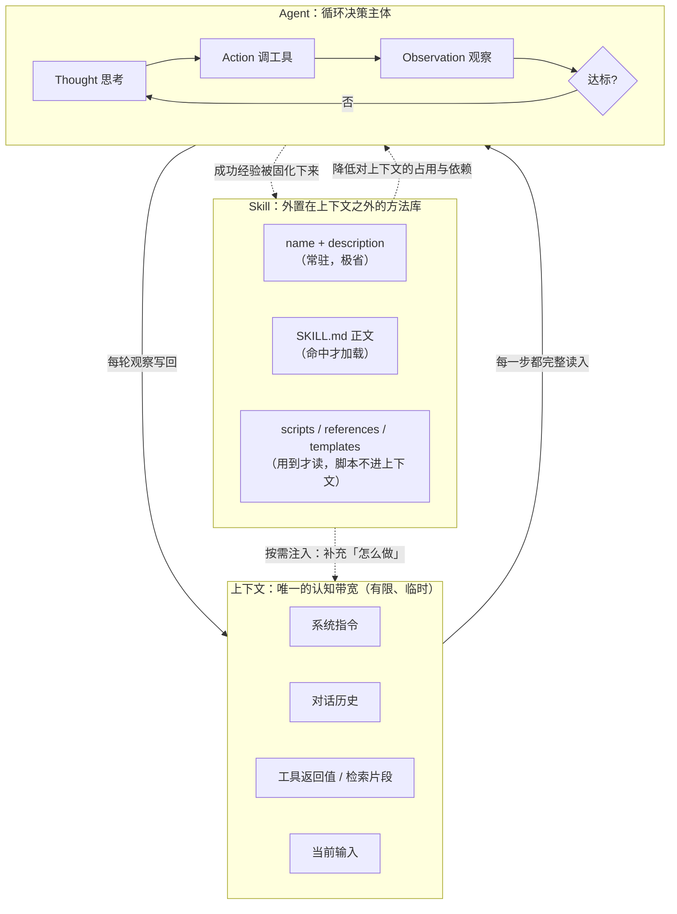
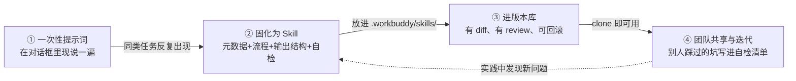

# 三个概念之间的关系：Agent、大模型的上下文、Skill

> 本文件是 `concept-study-forge` 生成三份学习资料之后的**综合说明**，重点回答两个问题：
> **① 上下文如何影响 Agent 的工作？** **② Skill 如何沉淀可复用的任务知识？**
> 单概念细节见：[`agent.html`](agent.html) · [`llm-context.html`](llm-context.html) · [`skill.html`](skill.html)

---

## 一、先给三个概念各安一个位置

| 概念 | 一句话 | 回答的问题 | 它坏了会怎样 |
| --- | --- | --- | --- |
| **上下文** | 模型这一次能同时看到的全部输入 | 「它现在知道什么」 | 看不见关键材料 → 决策失去依据 |
| **Agent** | 自己决定下一步、并调工具把事做完的程序 | 「谁在做事、怎么推进」 | 只能一次性回答，无法完成多步任务 |
| **Skill** | 把做某件事的成熟方法写成文件，按需注入 | 「这件事的标准做法是什么」 | 每次都从头现想流程，重复、易漂移 |

一句话概括三者的层级：**上下文是约束条件，Agent 是行动主体，Skill 是在约束之下让行动变可靠的工程手段。**

---

## 二、关系图

**文字版（Mermaid 不可渲染时对照阅读）：**
上下文是 Agent 每一步决策的唯一输入；Agent 每执行一轮，就把观察结果写回上下文；Skill 平时待在上下文之外，只在被判断相关时按需注入，从而在不挤占上下文的前提下把「标准做法」交给 Agent；Agent 跑通过的任务，其方法又可以被固化成新的 Skill。三者构成一条**闭环**。

---

## 三、重点一：上下文如何影响 Agent 的工作

结论先行：**上下文不是 Agent 的「输入参数」，而是它的「认知带宽」。** 这条带宽的宽窄、内容与排列方式，直接决定 Agent 能跑多少步、会不会跑偏。

| 影响路径 | 机制 | 后果 | 依据 |
| --- | --- | --- | --- |
| **① 决定每一步能看到什么** | Agent 的 Thought 只能基于上下文内容产生 | 关键不在上下文里 → 它根本不知道该考虑 | ReAct 循环本身（arXiv:2210.03629） |
| **② 每轮观察都会累积占用** | 每轮工具返回值都追加进上下文，下一轮完整读入 | 步数越多，上下文膨胀越快，成本与时延同步上升 | 见 `agent.html` 第 3.2 节流程图 |
| **③ 位置效应让它「忘本」** | 对长上下文中段内容的利用能力显著弱于首尾（U 形曲线） | 早期确定的目标与约束，跑到中段时可能「看不见」→ 行为漂移 | Lost in the Middle（arXiv:2307.03172） |
| **④ 溢出后被截断或压缩** | 窗口有硬上限，超出即截断 | 关键信息静默丢失，Agent 还以为自己看全了，照答不误 | 见 `llm-context.html` 第 5.2 节 |
| **⑤ 噪声稀释注意力** | 注意力在全部 token 间分配 | 无关内容越多，关键内容分到的注意力越少 | 自注意力机制（arXiv:1706.03762） |
| **⑥ 缓存依赖顺序稳定** | 不变前缀可命中缓存以降本降时延 | 上下文顺序一变，缓存失效，成本陡增 | Anthropic Prompt caching 文档 |

**一个可以直接观察到的推论**：正因为上下文是有限带宽，Agent 工程里几乎所有技巧——拆小步骤、及时压缩历史、把长结果落到文件只回传摘要、把流程外置为 Skill——本质上都是**上下文管理**。

> 我的判断：评价一个 Agent 系统，「它怎么管理上下文」比「它接了多少工具」更能预测实际表现。
> 反驳路径：如果任务本身步骤极少、上下文远未用满（如单步问答），那么上下文管理确实无关紧要，此时工具覆盖面和模型能力才是瓶颈。

---

## 四、重点二：Skill 如何沉淀可复用的任务知识

结论先行：**Skill 把「每次都要重新想一遍的流程」变成「一份放在仓库里、按需取用的文件」，沉淀的是程序性知识。**

### 4.1 沉淀路径（四步）

文字版：一次性提示词 → 同类任务反复出现后固化为 Skill → 提交进版本库，从此有 diff 与评审 → 他人 clone 即可复用并把踩过的坑补进自检清单 → 实践中发现新问题再回头改 Skill。

### 4.2 为什么它同时也是一种上下文管理策略

| 做法 | 上下文开销 | 稳定性 | 说明 |
| --- | --- | --- | --- |
| 每次口头交代流程 | 每轮重复占用 | 低，格式会漂移 | 流程内容挤占了本该留给任务材料的带宽 |
| 写进 Skill、按需加载 | 只占「名称+描述」（常驻） | 高，步骤固定 | **把方法论外置到上下文之外**，用时才注入 |
| 确定性动作写成脚本 | 脚本执行**不进上下文** | 最高，可复现 | 比让模型每次现场写代码更稳更省 |

这一点很关键：**Skill 与上下文并不是「两个独立概念」，Skill 本身就是应对上下文有限性的一套工程解法。** 它用「外置 + 按需加载」绕开了带宽约束。

### 4.3 与 Agent 研究中「技能库」的呼应

Voyager（arXiv:2304.01552）在 2023 年就提出让 Agent 把成功执行过的动作序列存进**技能库**反复调用。今天的 Skill 机制与之思路一脉相承，区别只在于：**技能库由 Agent 自己积累，Skill 由人主动编写。** 前者更自动但难审核，后者更可控且可评审——**当前的工程实践选择了后者**，这本身就是一条值得记住的判断。

### 4.4 Skill 还顺带缓解了 Agent 的错误累积

回到 `agent.html` 第 2 节的那个算式：多步循环成功率近似 `pⁿ`。Skill 从两个方向压低风险：

1. **减小 n**：流程固定后不必反复试错探索路径，步数下降；
2. **提高 p**：自检清单把「容易漏的步骤」变成显式检查项，单步成功率上升。

> 我的判断：Skill 对 Agent 的价值，与其说是「让它更聪明」，不如说是「让它少走弯路」。前者做不到（模型能力没变），后者做得到且效果显著。

---

## 五、同一个任务，三种配置下的差别（贯穿例子）

**任务：把一篇 PDF 论文整理成带可核查来源的中文笔记。**

| 配置 | 上下文里装的是什么 | 典型问题 |
| --- | --- | --- |
| **A. 无 Skill 的 Agent** | 任务材料 + 反复讨论「格式应该怎样」的对话 | 流程讨论挤占带宽；跑到中段容易忘记最初的格式约束；每周输出格式都在飘 |
| **B. 有 Skill 的 Agent** | 任务材料 + 一条被注入的标准流程（流程本身外置在文件里） | 上下文留给内容；步数减少、错误累积减轻；输出结果可复现 |
| **C. 只有 Skill，没有 Agent** | 人自己按步骤执行，模型只做单步辅助 | 步骤可靠但每步都要人推；无法自动跑完多轮循环 |

**三种配置不是互斥的，而是组合关系**：Skill 提供「怎么做」，Agent 提供「自己往下跑」，上下文提供「每一步看到的现场信息」。少任何一环，另外两环的价值都会打折。

---

## 六、我自己的整体判断（可被反驳）

> **上下文是硬约束，Agent 是主体，Skill 是约束之下的最优解。**
> 当前这一代系统的核心矛盾是：Agent 想做的事越来越多（步数 n 上升），而上下文带宽的增长跟不上；Skill 通过「知识外置 + 按需注入」，在不增加带宽的前提下塞进了大量可用能力，因此是当下性价比最高的工程手段。
>
> **怎么反驳我：** 若未来出现「原生超长且无损利用的上下文」（位置效应被彻底解决、成本与时延不再是瓶颈），那么 Skill 的「省上下文」价值将大幅下降，只剩下「可版本化、可团队共享」这一半价值。
> **反过来讲：** 即使那一天到来，Skill 仍然不会消失——因为它解决的从来不只是带宽问题，还有**知识能不能沉淀、能不能被别人复用**的问题。

---

## 七、概念关系自查表

| 检查项 | 结果 |
| --- | --- |
| 三个概念是否各有明确定位，且互不重叠 | ✅ 见第一节表格 |
| 是否说明了上下文对 Agent 的具体影响路径 | ✅ 六条路径，每条附依据 |
| 是否说明了 Skill 如何沉淀可复用知识 | ✅ 四步沉淀路径 + 表格 + 与技能库呼应 |
| 是否给出了自己的判断与反驳路径 | ✅ 第六节 |
| 是否有贯穿三个概念的统一例子 | ✅ 第五节 |
| 所有引用的论文与文档是否可核查 | ✅ 见各概念页第 7 节，均于 2026-09-04 验证可访问 |
